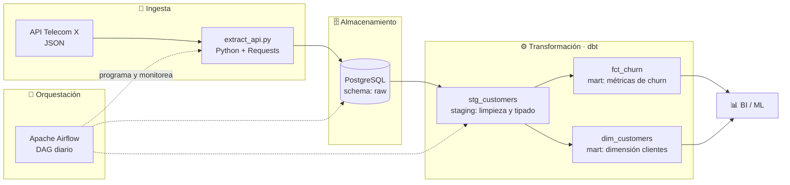
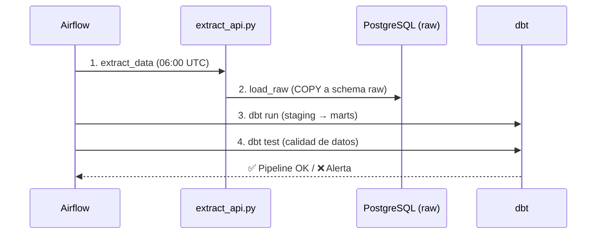

<div align="center">

# 📡 Telecom Churn ELT Pipeline

### Pipeline de datos end-to-end para análisis de fuga de clientes (churn)


</div>

---

## 📋 Descripción

Pipeline **ELT** (Extract → Load → Transform) que ingesta datos de clientes de una telco desde la API pública del challenge **Telecom X (Alura Latam)**, los carga en **PostgreSQL**, los transforma con **dbt** siguiendo arquitectura por capas (staging → marts) y orquesta todo con **Apache Airflow**. El entorno completo se levanta con un solo comando gracias a **Docker Compose**.

**Objetivo de negocio:** disponibilizar datos limpios y modelados para analizar la evasión de clientes (churn) y alimentar dashboards y modelos predictivos.

## 🏗️ Arquitectura del Pipeline



### Flujo diario del DAG



## 🛠️ Stack Tecnológico

| Capa | Tecnología | Rol |
|---|---|---|
| 🔽 Ingesta |  `requests` `pandas` | Extracción desde API y carga a raw |
| 🗄️ Almacenamiento |  | Data warehouse local (schemas `raw` y `analytics`) |
| ⚙️ Transformación |  | Modelado SQL por capas + tests de calidad |
| 🎯 Orquestación |  | Scheduling, reintentos y monitoreo |
| 📦 Infraestructura |  | Entorno reproducible con Docker Compose |

## 📁 Estructura del Proyecto

```text
telecom-churn-elt-pipeline/
├── 📂 dags/                  # DAGs de Airflow (definición del pipeline)
│   └── churn_pipeline_dag.py
├── 📂 ingestion/             # Scripts de extracción y carga (EL)
│   └── extract_api.py
├── 📂 dbt/                   # Proyecto dbt (T de ELT)
│   ├── dbt_project.yml
│   └── models/
│       ├── staging/          # Limpieza, tipado y renombrado (stg_*)
│       └── marts/            # Modelos de negocio (fct_*, dim_*)
├── 📂 tests/                 # Tests unitarios de los scripts Python
├── 📂 docs/                  # Documentación y diagramas
├── 🐳 docker-compose.yml     # Postgres + Airflow con un comando
├── 🔐 .env.example           # Variables de entorno (plantilla)
└── 📄 README.md
```

## 🚀 Despliegue Local

**Requisitos:** Docker y Docker Compose instalados.

```bash
# 1. Clonar el repositorio
git clone https://github.com/JuanYanaya88/telecom-churn-elt-pipeline.git
cd telecom-churn-elt-pipeline

# 2. Configurar variables de entorno
cp .env.example .env

# 3. Levantar el entorno (Postgres + Airflow)
docker-compose up -d

# 4. Abrir la UI de Airflow y activar el DAG
# http://localhost:8080  (usuario: airflow / contraseña: airflow)
```

```bash
# Ejecutar transformaciones dbt manualmente (opcional)
docker-compose exec airflow-scheduler bash -c "cd /opt/dbt && dbt run && dbt test"

# Apagar el entorno
docker-compose down
```

## ✅ Calidad de Datos

- Tests de **dbt**: `not_null`, `unique` y `accepted_values` sobre claves y campos críticos
- Reintentos automáticos y alertas de fallo configurados en el DAG de Airflow
- Datos crudos preservados en schema `raw` (auditabilidad y reproceso)

## 🗺️ Roadmap

- [x] Ingesta desde API y carga a PostgreSQL
- [x] Modelos staging y marts con dbt
- [x] Orquestación con Airflow + Docker Compose
- [ ] Migración del warehouse a BigQuery
- [ ] CI/CD con GitHub Actions (lint + dbt test en cada PR)
- [ ] Dashboard de churn en Looker Studio

## 👤 Autor

**Juan Yanaya** — Data Engineer en formación

[](https://github.com/JuanYanaya88)
[](mailto:juandasaenz.yanayaco@gmail.com)

> 💡 Proyecto de portafolio construido para demostrar prácticas modernas de ingeniería de datos: ELT, modelado por capas, testing y entornos reproducibles.
